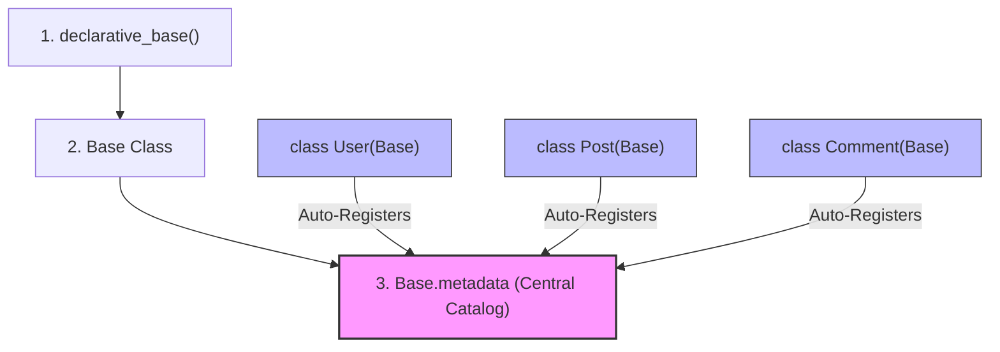

# 🎓 Architectural & Conceptual Master-Class: Database Migrations (Task 1.1)

Welcome to your advanced theoretical guide. This document contains no basic setup CLI steps; instead, it is designed to build a **rigorous mental model** of the underlying mechanisms, design patterns, and internal engine flows within the FastAPI + SQLAlchemy + Alembic + PostgreSQL stack.

---

## 🗺️ 1. The Global Connection Flow 

To write professional systems, you must understand how data and schemas flow through your codebase at both **migration time** (design phase) and **runtime** (execution phase).

### Flow A: The Alembic Schema Migration Flow (Design Time)
This flow represents how schema alterations in your code are converted into physical database structures.

1. **Step 1 — Developer Writes Code:** The developer defines or edits Python classes (like `class User(Base)`) representing tables in `app/models.py`.
2. **Step 2 — SQLAlchemy Registry Compilation:** When Python runs, SQLAlchemy registers these classes and compiles them into a central memory catalog called `Base.metadata`.
3. **Step 3 — Alembic Triggers Environment Execution:** When you run `alembic revision --autogenerate`, Alembic loads `alembic/env.py`. This environment script imports your code's catalog via `target_metadata = Base.metadata`.
4. **Step 4 — Secure Database Handshake:** The `env.py` script loads `.env` securely via `python-dotenv` and tells Alembic's configuration to use your dynamic `DATABASE_URL` (no hardcoding).
5. **Step 5 — Schema Difference Check (The Diff):** Alembic connects to your active PostgreSQL server. It compares the structural catalog in `Base.metadata` against the actual, physical tables currently living in PostgreSQL.
6. **Step 6 — Migration File Creation:** If a difference exists, Alembic writes a Python migration script (inside the `versions/` folder) containing the instructions (`upgrade()` and `downgrade()`) required to align PostgreSQL with your code.

### Flow B: The FastAPI Application Flow (Runtime)
This flow represents how a live web user reads from or writes data to the tables that migrations set up.

1. **Step 1 — Client Triggers Request:** A user makes an HTTP request to your backend (e.g. signing up via `POST /register`).
2. **Step 2 — FastAPI Router Activation:** The FastAPI router receives the request and triggers the corresponding endpoint path operation.
3. **Step 3 — Dependency Database Ingress:** The endpoint demands a database connection by calling the `get_db` dependency.
4. **Step 4 — Transaction Session Spun Up:** The `get_db` dependency invokes `SessionLocal()` (our `sessionmaker` factory), which checks out an active connection from the `engine` pool and spins up a transactional database session instance.
5. **Step 5 — SQLAlchemy Query Translation:** Inside your route, you interact with the database using Python objects (e.g., `db.add(new_user)`). SQLAlchemy's engine translates these Python operations into a raw SQL string (e.g., `INSERT INTO users...`).
6. **Step 6 — Database Execution & Tear-down:** The raw SQL is sent to PostgreSQL. The transaction is committed (`db.commit()`), and once the HTTP response is sent back to the client, the `get_db` context block automatically closes the session (`db.close()`), returning the connection to the engine's pool.

---

## ⚙️ 2. Deep-Dive: The SQLAlchemy Database Engine (`create_engine`)

The **Engine** is the structural foundation of any SQLAlchemy integration. It is created using `create_engine()`.

```python
engine = create_engine(DATABASE_URL, echo=True)
```

### What is the Engine?
The Engine is not an active connection itself; rather, it is a **connection pool manager** and **SQL compiler**. 
* **Connection Pool:** Opening and closing physical TCP connections to PostgreSQL is an expensive operation. The Engine maintains a warm pool of active connections (usually 5–10 by default) and "loans" them to sessions when needed, then reclaims them.
* **SQL Translation Dialect:** Python doesn't speak SQL, and PostgreSQL SQL has slight dialect variations compared to MySQL or SQLite. The engine knows which database dialect to use based on the driver specified in the `DATABASE_URL` (e.g. `postgresql+psycopg2`).

### What does the `echo=True` parameter do?
When `echo=True` is passed to the engine, it configures Python's standard `logging` library to write every single SQL statement compiled by SQLAlchemy directly to your terminal console.
* **Why it is vital for learning:** It lifts the veil of the ORM. When you call Python code (like saving a User model), `echo=True` shows you the exact raw `INSERT INTO users ...` SQL string sent to PostgreSQL, along with transaction timings.
* **Production Tip:** Always set `echo=False` in production, as logging every single select query slows down database operations and could accidentally log sensitive user data in plain text.

---

## 🏛️ 3. Deep-Dive: SQLAlchemy Session Mechanics (`sessionmaker`)

In `database.py`, we defined the database session factory like this:
```python
SessionLocal = sessionmaker(autocommit=False, autoflush=False, bind=engine)
```

To understand this, we must break down each parameter and define what a **Session** actually is.

### A. What is `sessionmaker` vs. `SessionLocal`?
* **`sessionmaker`** is a **Session Factory**. It is a configuration class that generates concrete `Session` instances with predefined behaviors.
* **`SessionLocal`** is the resulting factory. It is named `SessionLocal` by convention to emphasize that it is local to our application threads. Whenever we call `SessionLocal()`, it spins up a new, independent transaction session.

### B. What is a Database Session?
A **Session** is an implementation of the **Unit of Work** design pattern. It serves as a transactional workspace. The session:
1. Tracks changes made to your Python models.
2. Acts as a first-level cache (remembering objects queried during a single request).
3. Manages the transaction boundaries (the `BEGIN`, `COMMIT`, and `ROLLBACK` SQL commands).

---

### 📝 Parameter Breakdown

#### **1. `autocommit=False` (Explicit Transaction Control)**
* **The Concept:** If `autocommit` were set to `True`, every single Python modification (e.g., adding a user, updating a bio) would immediately execute its SQL and commit it permanently to the database as an isolated statement.
* **Why we set it to `False`:** 
  * We want **explicit transaction boundaries**. In professional backends, if we need to perform three operations (e.g., create a user profile, charge their card, and send a welcome email), we want all three to succeed or fail as a single unit (**Atomicity**).
  * With `autocommit=False`, SQLAlchemy begins a single transaction block. You must call `db.commit()` explicitly to write the changes permanently. If any step fails, you can call `db.rollback()` to revert the database state completely, preventing orphaned data.

#### **2. `autoflush=False` (Explicit Buffer Flushing)**
* **The Concept:** A "flush" is the act of sending pending modifications from Python memory to PostgreSQL's transactional buffer *before* committing. 
* **If `autoflush=True`:** Whenever you execute a query (like `db.query(User)`), SQLAlchemy automatically flushes any prior memory modifications (like a newly created user object) to the database buffers first, so that the query returns accurate results.
* **Why we set it to `False`:**
  * Setting it to `False` gives the developer complete manual control over when SQL is emitted. It prevents surprise DDL/DML execution in the background during complex transactions, ensuring that no database operations are sent to PostgreSQL until you explicitly call `db.flush()` or `db.commit()`.

#### **3. `bind=engine` (Associating Session with Database)**
* **The Concept:** A transaction session is purely abstract in memory. It doesn't know *where* to write or *how* to connect.
* **Why we do this:** The `bind=engine` parameter associates our session factory with our physical database connection pool engine. Whenever `SessionLocal()` is called, it binds that session to a connection checked out from the Engine's pool.

---

## 🧬 4. How SQLAlchemy Registers Models Under the Hood (`Base.metadata`)

To understand Alembic's autogeneration magic, we must examine how SQLAlchemy compiles Python classes into a schema catalog.

```python
Base = declarative_base()
```

### What is the Declarative Base?
`declarative_base()` is a class factory that returns a base class (`Base`). This base class serves as the **central registry** for your database tables.



### What is `Base.metadata`?
Inside the `Base` class, there is a special attribute called **`metadata`** (which is an instance of `sqlalchemy.schema.MetaData`). 
Think of `Base.metadata` as a **schema catalog** or dictionary. It keeps a structural map of:
* Every table name.
* Every column type, length, and nullability.
* Every primary key, foreign key, constraint, and index.

### How does model registration work?
Whenever the Python interpreter imports a file containing a class that inherits from `Base` (like `class User(Base):` in `models.py`), SQLAlchemy’s metaclass magic kicks in:
1. It reads the class definition.
2. It parses the SQLAlchemy attributes (like `Mapped[str]`).
3. It registers a new `Table` object containing all those parameters inside **`Base.metadata`**.

---

## 🔗 5. The Alembic Integration Mechanism

Now we can see exactly how Alembic integrates with our database and our models:

### A. The Database Connection Channel
Whenever we trigger a command like `alembic current` or `alembic upgrade head`, Alembic loads `alembic.ini` and runs `alembic/env.py`.
* In `env.py`, we override Alembic's configuration using `python-dotenv`:
  ```python
  config.set_main_option("sqlalchemy.url", database_url)
  ```
  This tells Alembic: *"Use our environment-driven connection string to connect to the physical PostgreSQL database."*

### B. The Model Schema Comparison Channel (Autogenerate)
In `alembic/env.py`, we set:
```python
from app.database import Base
from app import models  # Force imports so Python registers models into metadata

target_metadata = Base.metadata
```
* `target_metadata` is the channel through which Alembic inspects your code's schema catalog.
* When you run `--autogenerate`, Alembic:
  1. Inspects **`target_metadata`** to see what your code dictates.
  2. Connects to PostgreSQL via the **Engine** to see what actually exists in database memory.
  3. Diffs the two, and compiles the differences into a clean migration revision script!
